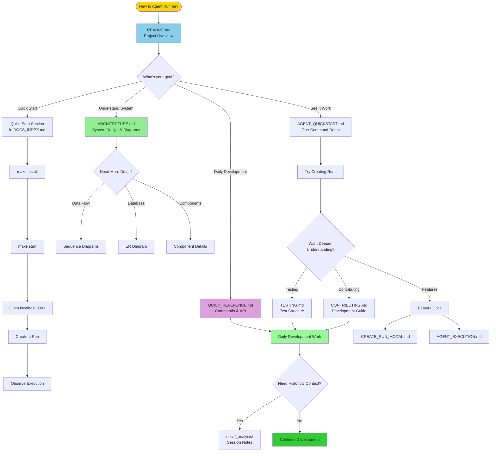

# 📚 Documentation Index - Start Here!

Welcome! This file helps you navigate the documentation for **Agent Runner**.

---

## 🚀 **Quick Start** (For Impatient Developers)

**Want to just run it?** Use this:

### Using Makefile (Recommended)
```bash
# Install dependencies
make install

# Start all services (background mode)
make start

# Or start in foreground (see logs directly)
make start-agent    # Terminal 1
make start-console  # Terminal 2

# View all commands
make help
```

### Manual Start (Alternative)
```bash
# Terminal 1 - Backend
cd agent-runner && source .venv/bin/activate && python -m uvicorn app.main:app --reload --port 8000

# Terminal 2 - Frontend  
cd console && npm run dev -- -p 3001
```

### Create Test Data
```bash
# Using test script (recommended)
./scripts/test-create-run-api.sh

# Or manually create project
curl -X POST "http://localhost:8000/projects?name=demo&local_path=/tmp/demo"

# Then create run (NEW JSON format)
curl -X POST "http://localhost:8000/runs" \
  -H "Content-Type: application/json" \
  -d '{"project_id": 1, "goal": "Write a hello world script"}'

# Or use the UI!
# Just click "Create Run" button in the Console
```

**Open browser:** http://localhost:3000 or http://localhost:3001


---

## 📖 **Documentation Guide**

### 🎯 If You Want To...

#### **Understand what this project is about**
→ Read the main `README.md` in the root  
→ Philosophy, goals, and vision

#### **See the architecture and current state**
→ Read [`docs/ARCHITECTURE.md`](docs/ARCHITECTURE.md)  
→ Service overview, system diagrams, data flows  
→ Component details and integration points

#### **Start using it quickly**
→ Read [`docs/QUICK_REFERENCE.md`](docs/QUICK_REFERENCE.md)  
→ All commands, ports, API endpoints  
→ Troubleshooting guide

#### **Understand the Create Run feature**
→ Read [`docs/CREATE_RUN_MODAL_IMPLEMENTATION.md`](docs/CREATE_RUN_MODAL_IMPLEMENTATION.md)  
→ Complete feature documentation  
→ API changes and migration guide

#### **Run tests**
→ Read [`docs/TESTING.md`](docs/TESTING.md)  
→ Test structure and commands  
→ Coverage reports

#### **See agent execution in action**
→ Read [`docs/AGENT_QUICKSTART.md`](docs/AGENT_QUICKSTART.md)  
→ One-command demo  
→ What to expect

#### **Review development history**
→ See [`docs/_analysis/`](docs/_analysis/) directory  
→ Time-stamped analysis from development sessions

---

## 📑 **All Documentation Files**

### Root Level
- **`README.md`** - Project overview, philosophy, getting started
- **`DOCS_INDEX.md`** - This file (navigation guide)

### `/docs` Directory

| File | Purpose | When to Read |
|------|---------|--------------|
| **[README.md](docs/README.md)** | Documentation index and overview | Start here |
| **[ARCHITECTURE.md](docs/ARCHITECTURE.md)** | System architecture, diagrams, data flows | Understanding the system |
| **[QUICK_REFERENCE.md](docs/QUICK_REFERENCE.md)** | Commands, ports, API reference | Daily development |
| **[CREATE_RUN_MODAL_IMPLEMENTATION.md](docs/CREATE_RUN_MODAL_IMPLEMENTATION.md)** | Create Run feature documentation | Understanding new features |
| **[TESTING.md](docs/TESTING.md)** | Testing guide and coverage | Running tests |
| **[AGENT_QUICKSTART.md](docs/AGENT_QUICKSTART.md)** | Quick agent execution demo | Seeing it in action |
| **[AGENT_EXECUTION.md](docs/AGENT_EXECUTION.md)** | Agent execution deep dive | Understanding worker logic |
| **[ARCHITECTURE_UPDATE_2026-02-01.md](docs/ARCHITECTURE_UPDATE_2026-02-01.md)** | Latest architectural changes | Recent updates |
| **[milestone-01-local-stack.md](docs/milestone-01-local-stack.md)** | Milestone 1 documentation | Project history |
| **[milestone-03-console-mvp.md](docs/milestone-03-console-mvp.md)** | Milestone 3 documentation | Console MVP details |

### `/docs/_analysis` Directory
Historical analysis and development notes (timestamped):
- `PROJECT_STATUS_2026-01-31.md`
- `ANALYSIS_SUMMARY_2026-01-31.md`
- `CODE_REVIEW_FIXES_2026-01-31.md`
- And more...

---

## 🎓 **Learning Path**

### Documentation Navigation Map



### For New Team Members
1. Read root [`README.md`](README.md)
2. Read [`docs/ARCHITECTURE.md`](docs/ARCHITECTURE.md)
3. Try Quick Start above
4. Bookmark [`docs/QUICK_REFERENCE.md`](docs/QUICK_REFERENCE.md)

### For Continuing Development
1. Use [`docs/QUICK_REFERENCE.md`](docs/QUICK_REFERENCE.md) for daily reference
2. Read [`docs/CREATE_RUN_MODAL_IMPLEMENTATION.md`](docs/CREATE_RUN_MODAL_IMPLEMENTATION.md) for latest features
3. Refer to [`docs/_analysis/`](docs/_analysis/) for historical context if needed

---

## 🔍 **Quick Reference Table**

| Need | File | Section |
|------|------|---------|
| Start services | [`docs/QUICK_REFERENCE.md`](docs/QUICK_REFERENCE.md) | "Start Everything" |
| API endpoints | [`docs/QUICK_REFERENCE.md`](docs/QUICK_REFERENCE.md) | "API Endpoints" |
| Architecture | [`docs/ARCHITECTURE.md`](docs/ARCHITECTURE.md) | All sections |
| System design | [`docs/ARCHITECTURE.md`](docs/ARCHITECTURE.md) | Diagrams |
| Data flow | [`docs/ARCHITECTURE.md`](docs/ARCHITECTURE.md) | "Data Flow" |
| Troubleshooting | [`docs/QUICK_REFERENCE.md`](docs/QUICK_REFERENCE.md) | "Troubleshooting" |
| Testing | [`docs/TESTING.md`](docs/TESTING.md) | All sections |
| Create Run feature | [`docs/CREATE_RUN_MODAL_IMPLEMENTATION.md`](docs/CREATE_RUN_MODAL_IMPLEMENTATION.md) | Complete guide |
| Philosophy | Root [`README.md`](README.md) | "Development Philosophy" |

---

## ✅ **What's Working Right Now**

Based on implemented and tested code:
- ✅ Agent Runner API (all REST endpoints operational, 27/27 tests passing)
- ✅ Background Worker (polls QUEUED runs, claims atomically, simulates execution)
- ✅ Console UI (dashboard with real-time polling, run detail page, controls)
- ✅ Create Run Modal (full form with name, type, goal, options, metadata - all fields working)
- ✅ Database (SQLite with enhanced schema including new Run columns)
- ✅ Run controls (pause, resume, stop endpoints functional)
- ✅ Event logging (events stored in DB and displayed in UI)
- ✅ Service status indicators (Worker, Forgejo, Taiga - UI badges with polling)

**Note:** Agent execution is currently simulated (logs events but doesn't perform real work). LLM integration and file operations are not yet implemented.

---

## 🚧 **What Needs Work**

Known gaps and future work:
- 🔴 Real LLM integration (Ollama not connected to agent logic yet)
- 🔴 Actual agent intelligence (currently simulated execution)
- 🔴 File operations (agents can't read/write files yet)
- 🔴 Git integration (no branch management, commits, diffs)
- 🔴 Multi-agent coordination
- 🔴 Forgejo/Taiga workflow integration

---

## 🚀 **Your Next Move**

### Test Current Features
```bash
# Start services
make start-agent    # Terminal 1
make start-console  # Terminal 2

# Test agent execution
make test-agent

# Open browser
open http://localhost:3000
```

### Explore Documentation
- **Quick reference:** [`docs/QUICK_REFERENCE.md`](docs/QUICK_REFERENCE.md)
- **Architecture:** [`docs/ARCHITECTURE.md`](docs/ARCHITECTURE.md)
- **Testing:** [`docs/TESTING.md`](docs/TESTING.md)

---

## 💬 **Need Help?**

**For quick lookups:**  
→ [`docs/QUICK_REFERENCE.md`](docs/QUICK_REFERENCE.md)

**For understanding the system:**  
→ [`docs/ARCHITECTURE.md`](docs/ARCHITECTURE.md)

**For testing:**  
→ [`docs/TESTING.md`](docs/TESTING.md)

**For debugging:**  
→ [`docs/QUICK_REFERENCE.md`](docs/QUICK_REFERENCE.md) → Troubleshooting section

---

## 📌 **Bookmark These**

Most useful for daily work:
1. [`docs/QUICK_REFERENCE.md`](docs/QUICK_REFERENCE.md) - Commands and API
2. [`docs/CREATE_RUN_MODAL_IMPLEMENTATION.md`](docs/CREATE_RUN_MODAL_IMPLEMENTATION.md) - Latest features
3. Root [`README.md`](README.md) - Project philosophy

Most useful for understanding:
1. [`docs/ARCHITECTURE.md`](docs/ARCHITECTURE.md) - Technical design
2. [`docs/README.md`](docs/README.md) - Documentation overview
3. [`docs/_analysis/`](docs/_analysis/) - Historical development notes

---

*Last updated: February 1, 2026*

*Start with the Quick Start section above, then explore based on what you need!*
