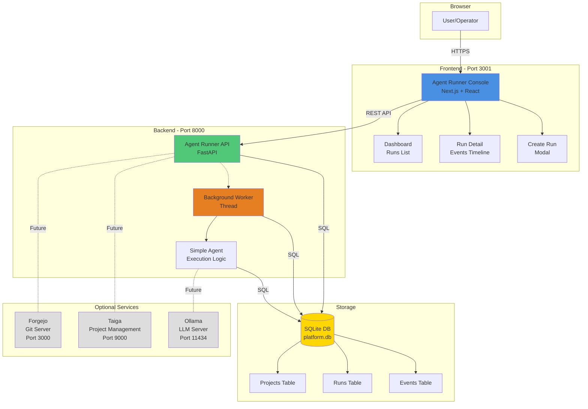

# Gemini Code Assistant Guide for Agent Runner

Welcome to the **Agent Runner** project! This guide is designed to help you use the Gemini Code Assistant to effectively understand, develop, and contribute to this project.

## 1. Project Overview

**Agent Runner** is a production-grade **agent execution control plane** with a modern web console for creating, monitoring, and controlling AI agent runs. It provides observability, lifecycle control, and resilience for AI agents.

The project consists of two main components:
- A **Next.js web console** for interacting with the system.
- A **FastAPI backend** that provides the Agent Runner API.

The system is designed to be extensible, with planned integrations for multiple LLM providers including **Gemini, Claude, and Ollama**, as well as services like Forgejo (Git server) and Taiga (project management).

## 2. Architecture

The project follows a modern web architecture with a clear separation between the frontend and backend.



- **Frontend**: A Next.js application that provides the user interface for the Agent Runner.
- **Backend**: A FastAPI application that exposes the Agent Runner API. It includes a background worker for processing agent runs.
- **Storage**: A SQLite database is used to store project data, runs, and events.
- **Optional Services**: The system is designed to integrate with other services like Forgejo, Taiga, and Ollama.

## 3. Getting Started

You can get the project up and running quickly using the provided `Makefile`.

### Prerequisites

- Docker and Docker Compose
- Node.js 18+
- Python 3.10+

### Setup and Running

1. **Install dependencies:**
   ```bash
   make install
   ```

2. **Start all services in the background:**
   ```bash
   make start
   ```

   Alternatively, you can run the backend and frontend in separate terminals to see their logs:
   ```bash
   # Terminal 1: Start the backend
   make start-agent

   # Terminal 2: Start the frontend
   make start-console
   ```

3. **Access the console:**
   Open [http://localhost:3001](http://localhost:3001) in your browser.


## 4. How to Use Gemini to Work on This Project

Gemini can help you with various development tasks. Here are a few examples:

### Example 1: Add a New Feature

**Prompt:**

> I want to add a new feature to the Agent Runner. I want to be able to see the logs of a run in the run detail page. Please implement this feature.

**Gemini's approach:**

1.  **Understand the feature request**: Gemini will analyze the request and identify the necessary changes. This includes:
    -   Adding a new API endpoint to get the logs of a run.
    -   Updating the frontend to display the logs.
2.  **Modify the backend**: Gemini will modify the `agent-runner/app/routes.py` file to add a new endpoint `/runs/{run_id}/logs`.
3.  **Modify the frontend**: Gemini will modify the `console/src/app/runs/[id]/page.tsx` file to fetch and display the logs.
4.  **Add tests**: Gemini will add tests for the new feature in both the backend and frontend.

### Example 2: Fix a Bug

**Prompt:**

> I found a bug in the Agent Runner. When I create a new run, the status is not updated in the run detail page. Please fix this bug.

**Gemini's approach:**

1.  **Understand the bug report**: Gemini will analyze the bug report and identify the cause of the problem.
2.  **Identify the affected code**: Gemini will identify the code that is responsible for updating the run status in the run detail page.
3.  **Fix the bug**: Gemini will modify the code to ensure that the run status is updated correctly.
4.  **Add tests**: Gemini will add tests to ensure that the bug is fixed and does not reoccur.

### Example 3: General questions

**Prompt:**

> Can you explain to me how the agent-runner background worker works?

**Gemini's approach:**

1.  **Analyze the question**: Gemini will analyze the question and identify the relevant files to answer the question.
2.  **Read the relevant files**: Gemini will read `agent-runner/app/worker.py` and `agent-runner/app/agent.py`.
3.  **Explain the code**: Gemini will explain how the background worker claims and executes runs.

### Example 4: Specifying a Model for a Task

**Prompt:**

> I want to use the "Claude Coder" model to add a new feature. Please add a new API endpoint to get the list of available models.

**Gemini's approach:**

1.  **Understand the request**: Gemini will understand that you want to use a specific model for the task.
2.  **Use the specified model**: Gemini will use the "Claude Coder" model to implement the new feature.
3.  **Implement the feature**: Gemini will add a new endpoint `/models` to the `agent-runner/app/routes.py` file and the corresponding logic to fetch the list of available models.

## 5. Key Project Files

- **`agent-runner/`**: The Python backend.
  - **`app/main.py`**: The entry point of the FastAPI application.
  - **`app/routes.py`**: The API routes.
  - **`app/worker.py`**: The background worker that executes agent runs.
  - **`app/agent.py`**: The agent execution logic.
  - **`tests/`**: The tests for the backend.
- **`console/`**: The Next.js frontend.
  - **`src/app/`**: The main application code.
  - **`src/app/runs/[id]/page.tsx`**: The run detail page.
  - **`src/lib/api.ts`**: The API client for the frontend.
  - **`src/hooks/`**: Custom React hooks for data fetching.
- **`docs/`**: Project documentation. A great place to start for more in-depth information.
- **`bruno/`**: API tests using Bruno.
- **`scripts/`**: Useful scripts for development and testing.

We hope this guide helps you get started with the Agent Runner project and Gemini!
