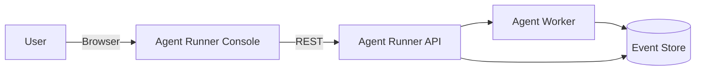

# Agent Runner

**Agent Runner** is a production-grade **agent execution control plane** with a modern web console for creating, monitoring, and controlling AI agent runs.

It focuses on **observability, lifecycle control, and resilience** — not magic abstractions.

---

## What Agent Runner Does

- Create and manage **agent runs**
- Observe **real-time execution via event timelines**
- Pause, resume, and stop runs safely
- Handle flaky networks and tab switching without breaking state
- Provide operators full visibility into what agents are doing

This repo contains the **Console UI** that talks to an Agent Runner API.

---

## Features

### Console UI
- Run dashboard with search + filtering
- Run detail page with full event timeline
- Manual controls: pause / resume / stop
- Copy-to-clipboard for event payloads
- Auto-scroll with manual override

### Production-Grade Polling
- Abortable requests everywhere
- Hard timeouts (no hanging fetches)
- Visibility-aware (pauses when tab hidden)
- Adaptive polling intervals
- Zero overlapping requests
- React Strict Mode safe

### Event Streaming
- Cursor-based incremental fetching
- Deduplication across retries
- Monotonic ordering
- Final fetch on terminal transitions
- Bounded memory buffer

---

## Architecture (High Level)



**Key concepts**
- **Run**: a unit of agent execution
- **Event**: immutable execution timeline entries
- **Console**: human-facing control plane

---

## Tech Stack

- **Framework:** Next.js (App Router)
- **UI:** React, Tailwind CSS
- **Icons:** lucide-react
- **Behavior:** hardened polling + event streaming
- **Language:** TypeScript

---

## Getting Started

### Prerequisites
- Node.js 18+
- Agent Runner API running locally or remotely

### Environment Variables

Create `.env.local`:

```bash
NEXT_PUBLIC_AGENT_RUNNER_URL=http://localhost:8000

# Optional service health indicators
NEXT_PUBLIC_FORGEJO_URL=http://localhost:3000
NEXT_PUBLIC_TAIGA_URL=http://localhost:9000

# Optional tuning
NEXT_PUBLIC_POLLING_INTERVAL_FAST=1500
NEXT_PUBLIC_POLLING_MAX_BACKOFF=30000
NEXT_PUBLIC_EVENT_MAX_BUFFER=1000
```

### Run the Console

```bash
npm install
npm run dev
```

Open: http://localhost:3000

---

## Design Philosophy

- **Observability first** — timelines over logs
- **Fail fast, recover cleanly** — aborts + timeouts everywhere
- **Explicit over clever** — readable state machines
- **Human-in-the-loop friendly** — operators stay in control
- **Production realism** — handles tab switches, reloads, flaky APIs

---

## Status

This project is **actively evolving**.
The core run → execution → event loop is complete and hardened.

---

## License

MIT
