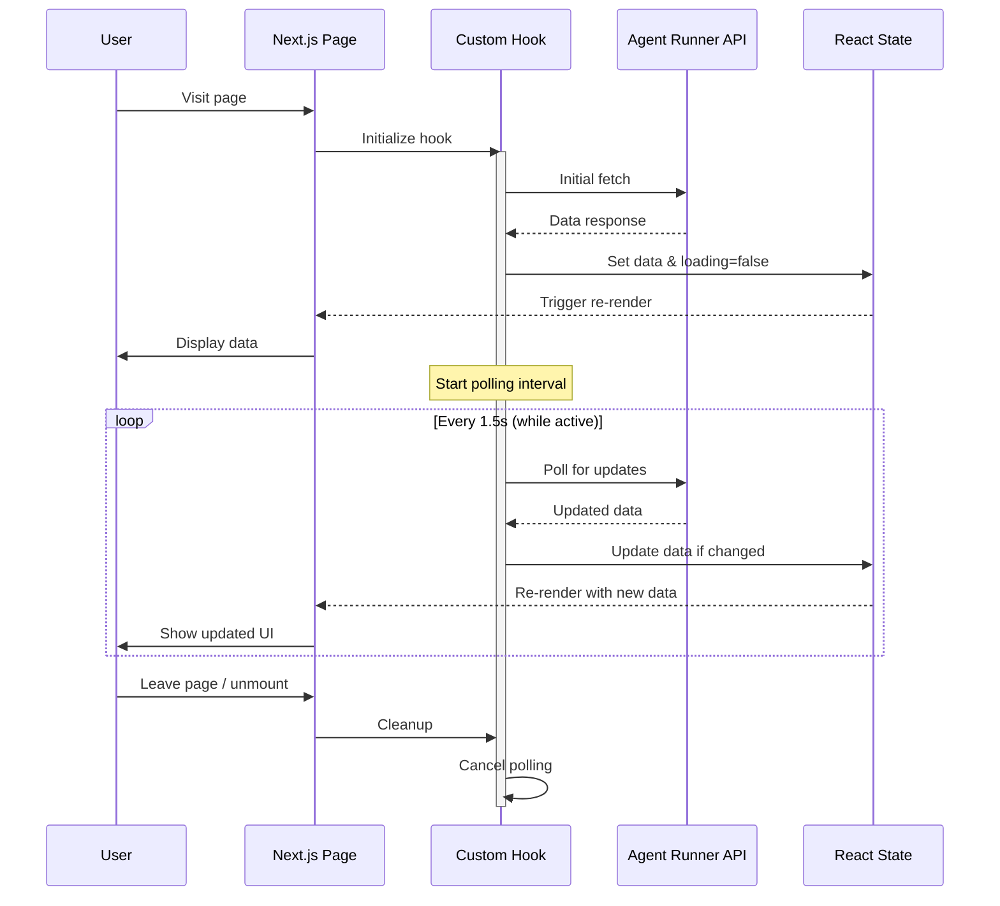
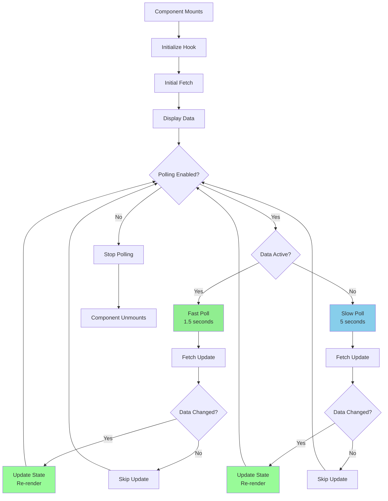

# Agent Runner Console - Modern UI

Beautiful, real-time console for monitoring and controlling AI agent runs.

## Features

### 🎨 Beautiful Modern UI
- Gradient backgrounds and smooth transitions
- Responsive design (mobile-first)
- Custom scrollbars and animations
- Professional color scheme

### ⚡ Real-Time Updates
- **Adaptive Polling**: Fast polling (1.5s) when runs are active, slower (5s) when idle
- Live status badges with animations
- Auto-updating statistics dashboard
- Real-time event timeline

### 📊 Dashboard
- **Statistics Cards**: Total runs, active runs, completed, failed
- **Smart Filtering**: "All" vs "Active Only" filter
- **Search**: Find runs by goal or ID
- **Worker Status Badge**: Shows if background worker is running

### 🔍 Run Detail Page
- **Beautiful Timeline**: Vertical timeline with icons for each event type
- **Auto-scroll**: Optional auto-scroll to latest events
- **Smart Event Display**: 
  - Code blocks for PLAN_GENERATED
  - Expandable long payloads
  - Icon indicators for event types
- **Real-time Controls**: Pause, Resume, Stop buttons
- **Directive Input**: Send directives to the agent

### 🎯 Status Pills
Animated status indicators:
- **QUEUED**: Blue with pulsing dot
- **RUNNING**: Green with animated pulsing dot
- **PAUSED**: Yellow
- **STOPPED**: Red
- **COMPLETED**: Emerald green
- **FAILED**: Red

## Tech Stack

- **Next.js 14**: React framework with App Router
- **TypeScript**: Type-safe development
- **Tailwind CSS**: Utility-first styling
- **Lucide React**: Beautiful icon set
- **date-fns**: Modern date formatting

## Development

```bash
# Install dependencies
npm install

# Run development server
npm run dev

# Open http://localhost:3000
```

## Environment Variables

Create `.env.local`:

```env
NEXT_PUBLIC_AGENT_RUNNER_URL=http://localhost:8000
```

## Architecture

### Component Hierarchy

```mermaid
flowchart TD
    App[Next.js App Router]
    
    App --> HomePage[/ Page<br/>Dashboard]
    App --> RunPage[/runs/[id] Page<br/>Run Detail]
    
    HomePage --> Stats[Statistics Cards]
    HomePage --> Filters[Search & Filter Bar]
    HomePage --> RunsList[Runs List]
    
    RunPage --> RunHeader[Run Header<br/>Status & Controls]
    RunPage --> Timeline[Event Timeline]
    RunPage --> DirectiveForm[Directive Input]
    
    RunsList --> RunCard[Run Card Component]
    RunCard --> StatusPill[Status Pill]
    
    Timeline --> TimelineEvent[Timeline Event]
    TimelineEvent --> EventIcon[Event Icon]
    TimelineEvent --> EventPayload[Event Payload]
    
    subgraph "Custom Hooks"
        useRun[useRun Hook<br/>Fetch & poll single run]
        useRuns[useRuns Hook<br/>Fetch & poll all runs]
        useRunEvents[useRunEvents Hook<br/>Fetch & poll events]
        usePolling[usePolling Hook<br/>Generic polling]
    end
    
    HomePage -.uses.-> useRuns
    RunPage -.uses.-> useRun
    RunPage -.uses.-> useRunEvents
    
    useRuns -.extends.-> usePolling
    useRun -.extends.-> usePolling
    useRunEvents -.extends.-> usePolling
    
    style App fill:#4A90E2
    style usePolling fill:#50C878
    style StatusPill fill:#FFD700
```

### Data Flow



### Polling Architecture



### Custom Hooks

#### `usePolling<T>`
Generic polling hook with configurable interval:
```typescript
const { data, loading, error, refetch } = usePolling(
  async () => fetch('/api/data').then(r => r.json()),
  { interval: 2000, enabled: true }
);
```

#### `useAdaptivePolling<T>`
Adaptive polling that adjusts speed based on data state:
```typescript
const { data, loading, error } = useAdaptivePolling(
  async () => fetch('/api/runs').then(r => r.json()),
  (data) => data?.some(run => run.status === 'RUNNING') // Fast poll when true
);
```

### Components

#### `StatusPill`
Animated status badge with color coding and pulsing dot for active states.

#### `Card`
Reusable card component with hover effects and shadows.

#### `EmptyState`
Beautiful empty state with icon, title, description, and optional action.

## Pages

### Dashboard (`/`)
- Statistics overview
- Runs list with filtering and search
- Real-time updates via adaptive polling
- Worker status indicator

### Run Detail (`/runs/[id]`)
- Real-time run status
- Event timeline with beautiful UI
- Control buttons (pause/resume/stop)
- Directive input
- Auto-scroll to latest events

## Performance

- **Fast Initial Load**: Optimized bundle size
- **Smart Polling**: Adaptive polling reduces server load
- **Smooth Animations**: Hardware-accelerated transitions
- **Optimistic UI**: Immediate feedback on user actions

## Design System

### Colors
- Primary: Blue (600)
- Success: Green/Emerald (500-700)
- Warning: Yellow (500-700)
- Danger: Red (500-700)
- Neutral: Gray (50-900)

### Spacing
- Cards: p-6
- Sections: gap-6, mb-8
- Elements: gap-2, gap-4

### Typography
- Headers: font-bold, text-2xl
- Subheaders: font-semibold, text-lg
- Body: text-gray-700
- Small: text-sm, text-gray-500

## Future Enhancements

- [ ] Create run modal with project dropdown
- [ ] Project management page
- [ ] Run history charts
- [ ] Export run data
- [ ] Dark mode
- [ ] WebSocket support for true real-time (replace polling)
- [ ] Notification system
- [ ] User preferences (polling interval, auto-scroll)

## Browser Support

- Chrome/Edge: ✅ Latest 2 versions
- Firefox: ✅ Latest 2 versions
- Safari: ✅ Latest 2 versions
- Mobile browsers: ✅ iOS Safari, Chrome Android
