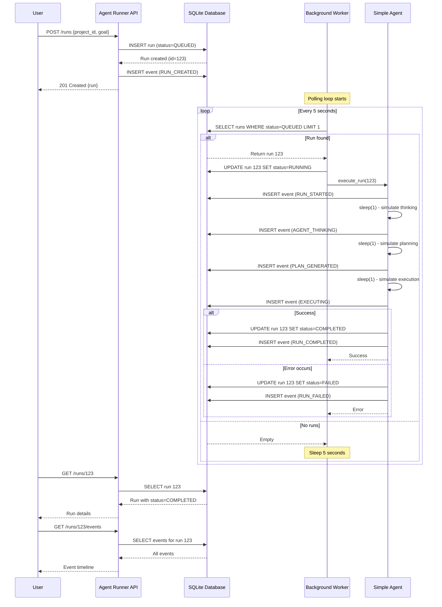
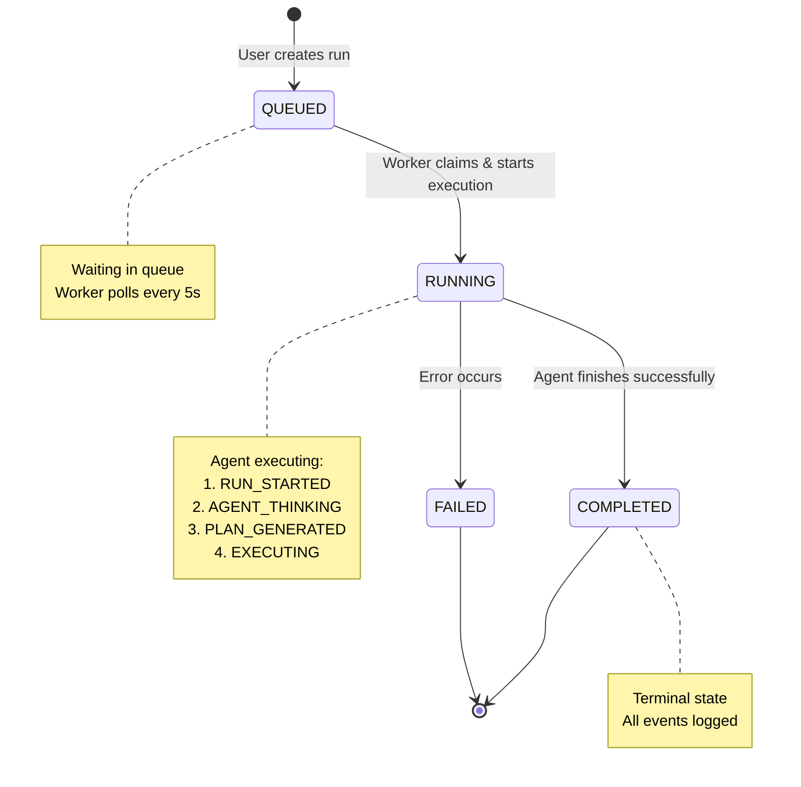

# Agent Execution - Implementation Complete! 🎉

## What Was Implemented

A **simple agent execution system** that proves the architecture works end-to-end.

### Features

✅ **Background Worker**
- Runs in a separate thread
- Checks for QUEUED runs every 5 seconds
- Processes runs automatically

✅ **Simple Agent**
- Executes runs through their lifecycle
- Transitions: QUEUED → RUNNING → COMPLETED
- Logs events at each step
- Simulates "thinking", "planning", and "executing"

✅ **Status Management**
- Automatic status transitions
- Iteration counter tracks progress
- Failure handling (marks as FAILED on error)

✅ **Event Logging**
- RUN_STARTED
- AGENT_THINKING
- PLAN_GENERATED
- EXECUTING
- RUN_COMPLETED (or RUN_FAILED)

## Files Created

1. **`agent-runner/app/agent.py`** - Simple agent that executes runs
2. **`agent-runner/app/worker.py`** - Background worker thread
3. **`scripts/test-agent-execution.sh`** - End-to-end test script

## Files Modified

1. **`agent-runner/app/main.py`** - Starts worker on startup, adds logging
2. **`agent-runner/app/routes.py`** - Added `/worker/status` and `/worker/process` endpoints
3. **`Makefile`** - Added `make test-agent` command

## How It Works

**Textual Flow:**
```
User creates run
       ↓
Run created with status=QUEUED
       ↓
Background worker finds it (checks every 5s)
       ↓
Agent.execute_run(run_id) called
       ↓
Status: QUEUED → RUNNING
Event: RUN_STARTED
       ↓
Simulate thinking (1s)
Event: AGENT_THINKING
       ↓
Simulate planning (1s)
Event: PLAN_GENERATED
       ↓
Simulate execution (1s)
Event: EXECUTING
       ↓
Status: RUNNING → COMPLETED
Event: RUN_COMPLETED
       ↓
Done! ✅
```

**Detailed Sequence Diagram:**


**State Machine:**


## How to Test

### Option 1: Automated Test Script
```bash
# Start agent runner first
make start-agent

# In another terminal, run the test
make test-agent
```

### Option 2: Manual Testing
```bash
# 1. Start agent runner
make start-agent

# 2. Create a project
curl -X POST "http://localhost:8000/projects?name=test&local_path=/tmp/test"

# 3. Create a run
curl -X POST "http://localhost:8000/runs" \
  -H "Content-Type: application/json" \
  -d '{"project_id": 1, "goal": "Test execution"}'

# 4. Watch it process (should take ~3-4 seconds)
watch -n 1 'curl -s http://localhost:8000/runs/1 | python3 -m json.tool'

# 5. Check events
curl -s http://localhost:8000/runs/1/events | python3 -m json.tool
```

### Option 3: Via Console UI
```bash
# 1. Start both services
make start

# 2. Open console
open http://localhost:3001

# 3. Create a run via API
curl -X POST "http://localhost:8000/runs" \
  -H "Content-Type: application/json" \
  -d '{"project_id": 1, "goal": "Test from UI"}'

# 4. Watch it in the UI
# The run will automatically transition from QUEUED → RUNNING → COMPLETED
# No refresh required - the UI uses hardened polling hooks.
```

## API Endpoints Added

### GET /worker/status
Check if background worker is running:
```bash
curl http://localhost:8000/worker/status
```

Response:
```json
{
  "running": true,
  "check_interval": 5
}
```

### POST /worker/process
Manually trigger processing (useful for testing):
```bash
curl -X POST http://localhost:8000/worker/process
```

## What's Next

This is a **"dumb agent"** - it doesn't do real work yet. Future enhancements:

### Phase 2: Real LLM Integration
- Connect to Ollama
- Send goal to LLM
- Parse LLM response into steps

### Phase 3: File Operations
- Read project files
- Write file changes
- Safety checks (whitelist paths)

### Phase 4: Git Integration
- Create feature branches
- Track changes
- Prepare commits

### Phase 5: User Approval
- Pause before executing
- Show proposed changes
- Require approval to proceed

## Configuration

The worker can be configured in `.env` (backend) and `worker.py`:
- `WORKER_CHECK_INTERVAL`: How often to check for queued runs (default: 5 seconds)
- `WORKER_BATCH_SIZE`: How many runs to process in one cycle (default: 10)

## Troubleshooting

### Worker Not Starting
Check logs when starting agent runner:
```
INFO:     Started server process
INFO:app.worker:Background worker started (check interval: 5s)
INFO:app.worker:Worker loop started
```

### Runs Stuck in QUEUED
- Check worker status: `curl http://localhost:8000/worker/status`
- Manually trigger: `curl -X POST http://localhost:8000/worker/process`
- Check logs for errors

### Runs Failing Immediately
- Check agent runner logs
- Look for exceptions in worker loop
- Database connection issues?

## Architecture Notes

**Why threading instead of async?**
- Simpler for this MVP
- Works well for background processing
- Easy to understand and debug
- Can migrate to Celery/RQ later if needed

**Why daemon thread?**
- Automatically stops when app stops
- No need for complex shutdown logic
- FastAPI handles the lifecycle

**Why 5-second interval?**
- Fast enough for demo/testing
- Slow enough to not waste resources
- Can be adjusted based on needs

## Success Criteria

✅ **This implementation proves:**
1. Runs can be created via API
2. Background worker picks them up automatically
3. Agent executes them through lifecycle
4. Status transitions happen automatically
5. Events are logged for visibility
6. The full architecture works end-to-end

**Next step:** Add real LLM integration to make the agent actually "think"!

## Testing Checklist

- [x] Agent file created
- [x] Worker file created
- [x] Main.py starts worker
- [x] Routes have worker endpoints
- [x] Test script created
- [x] Makefile updated
- [ ] Test with agent runner running
- [ ] Verify runs transition automatically
- [ ] Check events are logged
- [ ] Verify in UI (with refresh)

---

**Status:** ✅ Implementation complete  
**What it does:** Runs actually execute automatically!  
**What's missing:** Real LLM integration, file operations, Git integration  
**Next:** Test it and commit!
