# Quick Start - Agent Execution

## TL;DR

```bash
# Start agent runner
make start-agent

# In another terminal, test it
make test-agent
```

You'll see a run automatically execute and complete in ~3-4 seconds!

## What You'll See

### Execution Flow Visualization

```mermaid
sequenceDiagram
    participant Script as Test Script
    participant API as Agent Runner
    participant Worker as Background Worker
    participant Agent
    participant DB as Database
    
    Script->>API: 1. Check health
    API-->>Script: ✅ Running
    
    Script->>API: 2. Check worker status
    API-->>Script: ✅ Worker running
    
    Script->>API: 3. Create project
    API->>DB: INSERT project
    API-->>Script: ✅ Project ID=1
    
    Script->>API: 4. Create run
    API->>DB: INSERT run (status=QUEUED)
    API-->>Script: ✅ Run ID=1, status=QUEUED
    
    Note over Script: Start polling...
    
    Script->>API: Poll: GET /runs/1
    API-->>Script: status=QUEUED ⏳
    
    Note over Worker: Worker detects run
    Worker->>DB: Claim run (status=RUNNING)
    Worker->>Agent: execute_run(1)
    
    Script->>API: Poll: GET /runs/1
    API-->>Script: status=RUNNING ⏳
    
    Agent->>DB: Log event (RUN_STARTED)
    Agent->>Agent: Think (1s)
    Agent->>DB: Log event (AGENT_THINKING)
    Agent->>Agent: Plan (1s)
    Agent->>DB: Log event (PLAN_GENERATED)
    Agent->>Agent: Execute (1s)
    Agent->>DB: Log event (EXECUTING)
    Agent->>DB: UPDATE status=COMPLETED
    Agent->>DB: Log event (RUN_COMPLETED)
    
    Script->>API: Poll: GET /runs/1
    API-->>Script: status=COMPLETED ✅
    
    Script->>API: GET /runs/1/events
    API->>DB: SELECT events
    API-->>Script: All 6 events
    
    Note over Script: Test complete!
```



### Terminal Output

```
🧪 Testing Agent Execution
==========================

1. Checking agent runner status...
✅ Agent runner is running

2. Checking background worker...
   Worker status: {"running":true,"check_interval":5}

3. Creating test project...
✅ Project created (ID: 1)

4. Creating test run...
✅ Run created (ID: 1, Status: QUEUED)

5. Waiting for agent to process run (max 30 seconds)...
   [1] Status: QUEUED ⏳
   [2] Status: RUNNING ⏳
   [3] Status: RUNNING ⏳
   [4] Status: COMPLETED ✅

6. Checking final run status...
{
  "id": 1,
  "project_id": 1,
  "goal": "Test agent execution",
  "status": "COMPLETED",
  "current_iteration": 4,
  "created_at": "..."
}

7. Checking run events...
[
  {
    "id": 1,
    "run_id": 1,
    "type": "RUN_CREATED",
    "payload": "Test agent execution",
    "created_at": "..."
  },
  {
    "id": 2,
    "run_id": 1,
    "type": "RUN_STARTED",
    "payload": "Agent execution started",
    "created_at": "..."
  },
  {
    "id": 3,
    "run_id": 1,
    "type": "AGENT_THINKING",
    "payload": "Analyzing goal: Test agent execution",
    "created_at": "..."
  },
  {
    "id": 4,
    "run_id": 1,
    "type": "PLAN_GENERATED",
    "payload": "Plan for 'Test agent execution':...",
    "created_at": "..."
  },
  {
    "id": 5,
    "run_id": 1,
    "type": "EXECUTING",
    "payload": "Simulating work execution...",
    "created_at": "..."
  },
  {
    "id": 6,
    "run_id": 1,
    "type": "RUN_COMPLETED",
    "payload": "Agent execution completed successfully",
    "created_at": "..."
  }
]

=========================================
✅ Agent execution test complete!

What happened:
  1. Created a test run in QUEUED status
  2. Background worker picked it up
  3. Agent executed it (simulated work)
  4. Run transitioned: QUEUED → RUNNING → COMPLETED
  5. Events were logged at each step

🎉 The architecture works end-to-end!
```

## That's It!

Your agent runner now:
- ✅ Automatically processes queued runs
- ✅ Changes status through lifecycle
- ✅ Logs events for visibility
- ✅ Proves the architecture works!

Next: Add real LLM integration to make it actually think!
