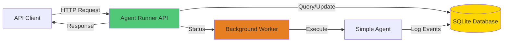
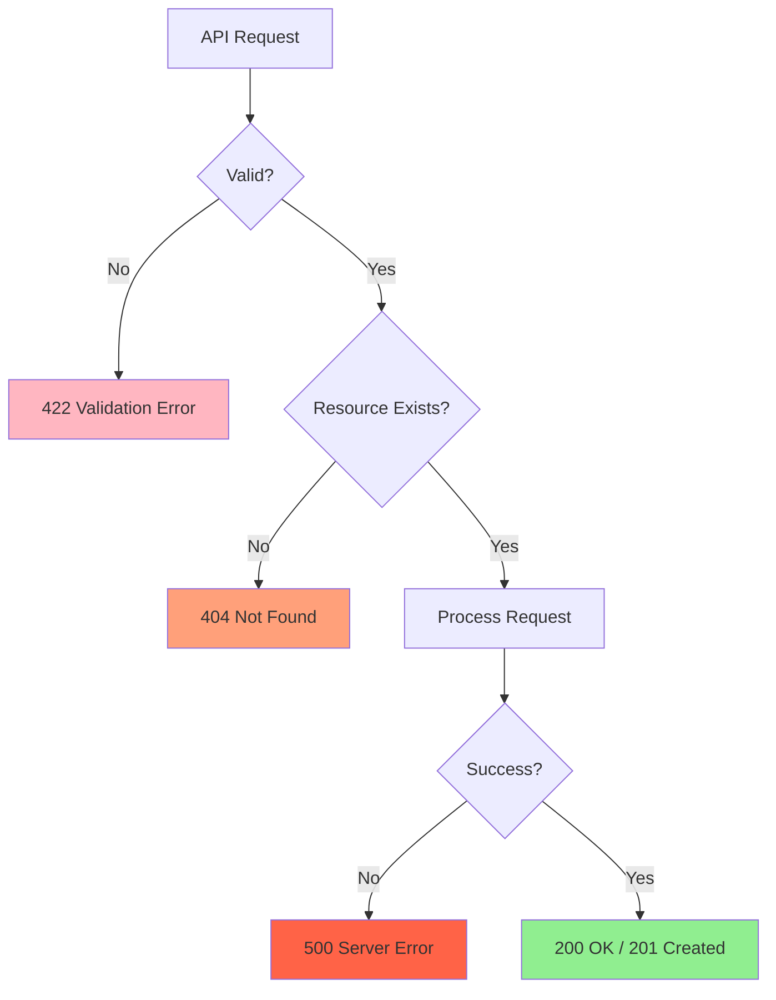
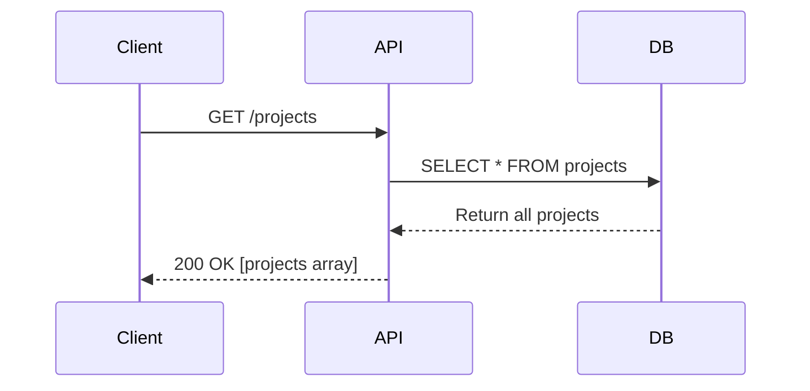
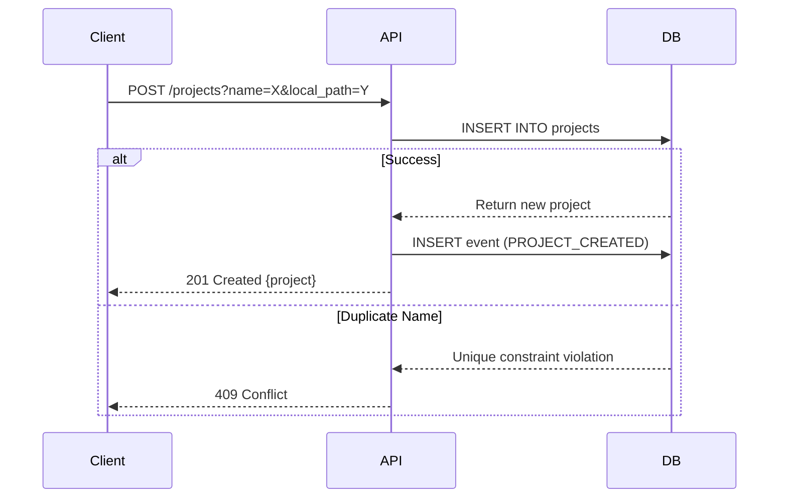
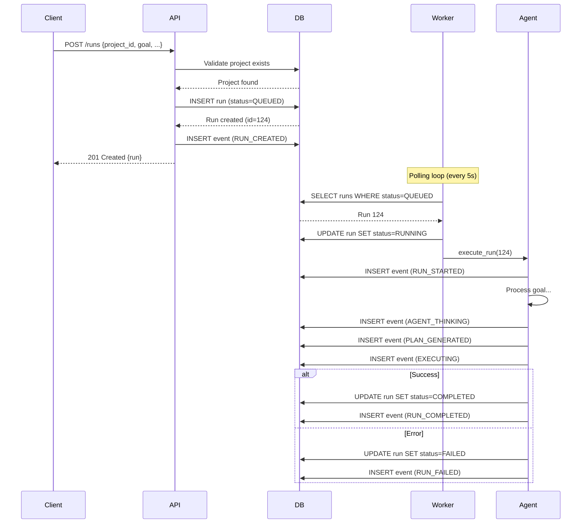
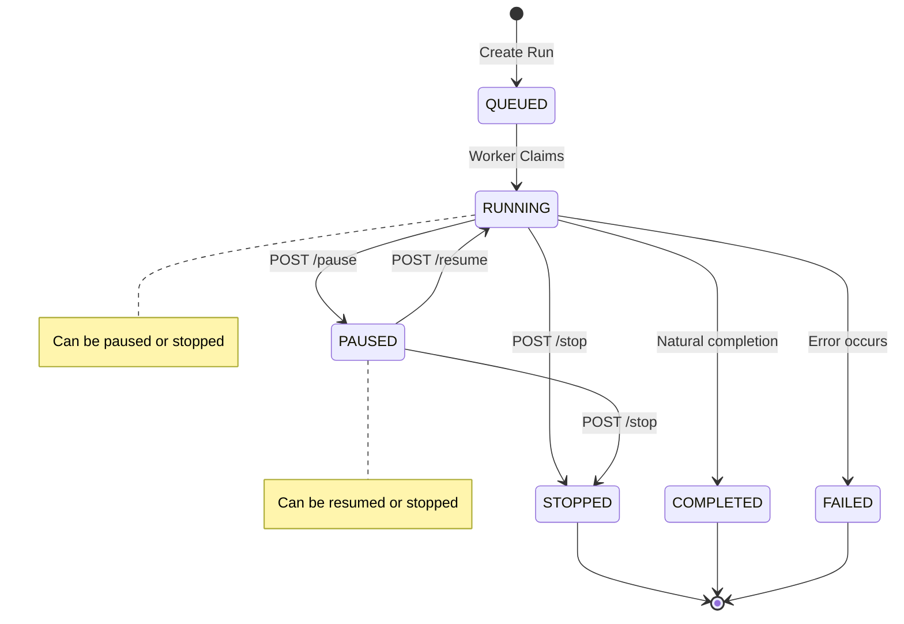
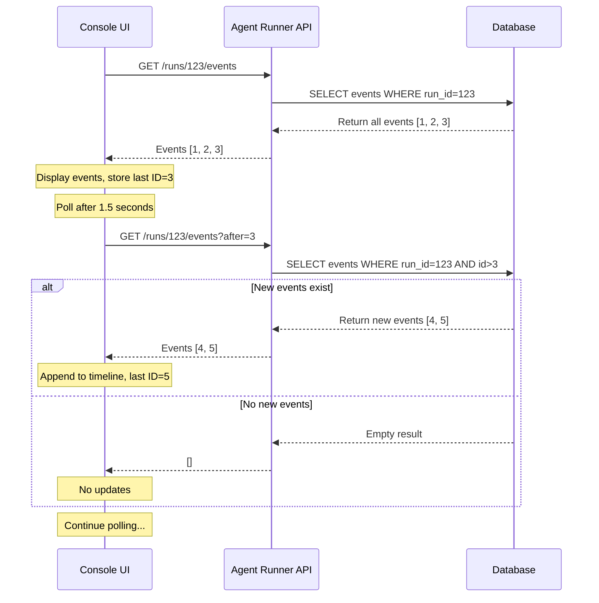
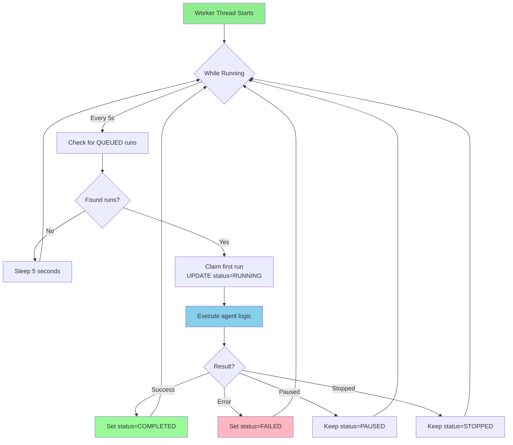
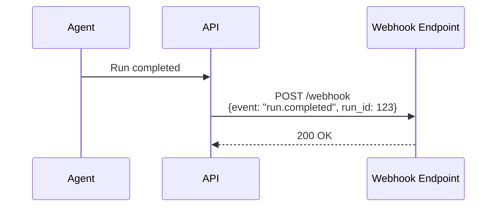

# API Reference - Agent Runner

Complete reference for the Agent Runner REST API.

**Base URL:** `http://localhost:8000`  
**API Documentation:** `http://localhost:8000/docs` (Swagger UI)

---

## Table of Contents

1. [Overview](#overview)
2. [Authentication](#authentication)
3. [Response Format](#response-format)
4. [Error Handling](#error-handling)
5. [Endpoints](#endpoints)
   - [Health](#health)
   - [Projects](#projects)
   - [Runs](#runs)
   - [Events](#events)
   - [Worker](#worker)

---

## Overview

The Agent Runner API is a RESTful API built with FastAPI that provides:
- Project management
- Run lifecycle control
- Event streaming
- Background worker monitoring



---

## Authentication

**Current Status:** No authentication required (local development).

**Future:** Will support API keys and JWT tokens for production deployments.

---

## Response Format

### Success Response

All successful responses return JSON with appropriate HTTP status codes:

```json
{
  "id": 123,
  "name": "example",
  "status": "success",
  "data": {}
}
```

### Error Response

Error responses include a detail message:

```json
{
  "detail": "Error message describing what went wrong"
}
```

**HTTP Status Codes:**
- `200` - Success
- `201` - Created
- `400` - Bad Request
- `404` - Not Found
- `422` - Validation Error
- `500` - Internal Server Error

---

## Error Handling

### Common Errors



### Error Examples

**404 Not Found:**
```bash
curl http://localhost:8000/runs/999
# Response: {"detail": "Run not found"}
```

**422 Validation Error:**
```bash
curl -X POST http://localhost:8000/runs \
  -H "Content-Type: application/json" \
  -d '{"goal": "missing project_id"}'
# Response: {"detail": [{"loc": ["body", "project_id"], "msg": "field required"}]}
```

---

## Endpoints

## Health

### GET /health

Check if the API is running.

**Request:**
```bash
curl http://localhost:8000/health
```

**Response:**
```json
{
  "status": "healthy",
  "version": "1.0.0"
}
```

---

## Projects

Projects represent code repositories or workspaces where agents operate.

### GET /projects

List all projects.

**Request:**
```bash
curl http://localhost:8000/projects
```

**Response:**
```json
[
  {
    "id": 1,
    "name": "demo-project",
    "local_path": "/tmp/demo",
    "created_at": "2026-02-01T10:30:00"
  }
]
```

**Sequence Diagram:**


---

### POST /projects

Create a new project.

**Query Parameters:**
- `name` (required) - Project name (must be unique)
- `local_path` (required) - Filesystem path for the project

**Request:**
```bash
curl -X POST "http://localhost:8000/projects?name=my-project&local_path=/tmp/my-project"
```

**Response:**
```json
{
  "id": 2,
  "name": "my-project",
  "local_path": "/tmp/my-project",
  "created_at": "2026-02-02T01:00:00"
}
```

**Status Codes:**
- `201` - Project created successfully
- `400` - Invalid parameters
- `409` - Project name already exists

**Sequence Diagram:**


---

## Runs

Runs represent agent execution instances with lifecycle management.

### Run Object Schema

```json
{
  "id": 123,
  "project_id": 1,
  "name": "Optional friendly name",
  "goal": "What the agent should accomplish",
  "run_type": "agent",
  "status": "QUEUED",
  "current_iteration": 0,
  "options": {
    "dry_run": false,
    "verbose": true,
    "max_steps": 10
  },
  "run_metadata": {
    "custom_field": "value"
  },
  "created_at": "2026-02-02T01:00:00"
}
```

**Status Values:**
- `QUEUED` - Waiting for worker
- `RUNNING` - Currently executing
- `PAUSED` - Temporarily suspended
- `STOPPED` - Terminated by user
- `COMPLETED` - Successfully finished
- `FAILED` - Error occurred

**Run Type Values:**
- `agent` - Single agent execution (default)
- `workflow` - Multi-step workflow
- `pipeline` - Sequential pipeline
- `task` - One-time task

---

### GET /runs

List all runs (newest first).

**Request:**
```bash
curl http://localhost:8000/runs
```

**Response:**
```json
[
  {
    "id": 5,
    "project_id": 1,
    "name": "Feature implementation",
    "goal": "Add authentication",
    "run_type": "agent",
    "status": "COMPLETED",
    "current_iteration": 3,
    "options": {"max_steps": 10},
    "run_metadata": {"priority": "high"},
    "created_at": "2026-02-02T00:30:00"
  }
]
```

---

### GET /runs/{id}

Get details of a specific run.

**Request:**
```bash
curl http://localhost:8000/runs/123
```

**Response:**
```json
{
  "id": 123,
  "project_id": 1,
  "name": "Feature work",
  "goal": "Implement feature X",
  "run_type": "agent",
  "status": "RUNNING",
  "current_iteration": 2,
  "options": {},
  "run_metadata": {},
  "created_at": "2026-02-02T01:00:00"
}
```

**Status Codes:**
- `200` - Success
- `404` - Run not found

---

### POST /runs

Create a new run.

**Request Body (JSON):**
```json
{
  "project_id": 1,
  "goal": "Implement authentication system",
  "name": "Auth Feature",
  "run_type": "agent",
  "options": {
    "dry_run": false,
    "verbose": true,
    "max_steps": 10
  },
  "run_metadata": {
    "priority": "high",
    "assignee": "agent-1"
  }
}
```

**Required Fields:**
- `project_id` (integer)
- `goal` (string)

**Optional Fields:**
- `name` (string) - Auto-generated if not provided
- `run_type` (string) - Defaults to "agent"
- `options` (object) - Configuration options
- `run_metadata` (object) - Custom metadata

**Request:**
```bash
curl -X POST http://localhost:8000/runs \
  -H "Content-Type: application/json" \
  -d '{
    "project_id": 1,
    "goal": "Write hello world script",
    "name": "Hello World",
    "run_type": "agent",
    "options": {"verbose": true}
  }'
```

**Response:**
```json
{
  "id": 124,
  "project_id": 1,
  "name": "Hello World",
  "goal": "Write hello world script",
  "run_type": "agent",
  "status": "QUEUED",
  "current_iteration": 0,
  "options": {"verbose": true},
  "run_metadata": {},
  "created_at": "2026-02-02T01:05:00"
}
```

**Status Codes:**
- `201` - Run created successfully
- `400` - Invalid request body
- `404` - Project not found

**Complete Flow Diagram:**


---

### POST /runs/{id}/pause

Pause a running execution.

**Request:**
```bash
curl -X POST http://localhost:8000/runs/123/pause
```

**Response:**
```json
{
  "id": 123,
  "status": "PAUSED",
  "...": "..."
}
```

**Status Codes:**
- `200` - Successfully paused
- `400` - Run not in RUNNING state
- `404` - Run not found

---

### POST /runs/{id}/resume

Resume a paused execution.

**Request:**
```bash
curl -X POST http://localhost:8000/runs/123/resume
```

**Response:**
```json
{
  "id": 123,
  "status": "RUNNING",
  "...": "..."
}
```

**Status Codes:**
- `200` - Successfully resumed
- `400` - Run not in PAUSED state
- `404` - Run not found

---

### POST /runs/{id}/stop

Stop a running or paused execution.

**Request:**
```bash
curl -X POST http://localhost:8000/runs/123/stop
```

**Response:**
```json
{
  "id": 123,
  "status": "STOPPED",
  "...": "..."
}
```

**Status Codes:**
- `200` - Successfully stopped
- `404` - Run not found

**Control Flow State Machine:**


---

## Events

Events provide an immutable audit trail of run execution.

### Event Object Schema

```json
{
  "id": 456,
  "run_id": 123,
  "type": "AGENT_THINKING",
  "payload": {
    "message": "Analyzing requirements...",
    "context": {}
  },
  "created_at": "2026-02-02T01:00:30"
}
```

**Common Event Types:**
- `RUN_CREATED` - Run was created
- `RUN_STARTED` - Execution began
- `AGENT_THINKING` - Agent is analyzing
- `PLAN_GENERATED` - Plan created
- `EXECUTING` - Executing steps
- `RUN_PAUSED` - Execution paused
- `RUN_RESUMED` - Execution resumed
- `RUN_STOPPED` - Execution stopped
- `RUN_COMPLETED` - Successfully completed
- `RUN_FAILED` - Failed with error

---

### GET /runs/{id}/events

Get all events for a run.

**Query Parameters (optional):**
- `after` (integer) - Cursor for pagination (event ID)
- `limit` (integer) - Number of events to return (default: 100)

**Request:**
```bash
curl http://localhost:8000/runs/123/events
```

**Response:**
```json
[
  {
    "id": 1,
    "run_id": 123,
    "type": "RUN_CREATED",
    "payload": {"source": "api"},
    "created_at": "2026-02-02T01:00:00"
  },
  {
    "id": 2,
    "run_id": 123,
    "type": "RUN_STARTED",
    "payload": {"worker_id": "worker-1"},
    "created_at": "2026-02-02T01:00:05"
  },
  {
    "id": 3,
    "run_id": 123,
    "type": "AGENT_THINKING",
    "payload": {"message": "Analyzing goal..."},
    "created_at": "2026-02-02T01:00:06"
  }
]
```

**Incremental Fetch (Cursor-based):**
```bash
# Get events after ID 3
curl http://localhost:8000/runs/123/events?after=3
```

**Event Streaming Pattern:**


---

### POST /runs/{id}/directive

Add a directive event (human instruction to agent).

**Request Body:**
```json
{
  "text": "Please add error handling to the function"
}
```

**Request:**
```bash
curl -X POST http://localhost:8000/runs/123/directive \
  -H "Content-Type: application/json" \
  -d '{"text": "Add error handling"}'
```

**Response:**
```json
{
  "id": 10,
  "run_id": 123,
  "type": "DIRECTIVE",
  "payload": {
    "text": "Add error handling",
    "from": "user"
  },
  "created_at": "2026-02-02T01:10:00"
}
```

**Status Codes:**
- `201` - Directive created
- `400` - Invalid request body
- `404` - Run not found

---

## Worker

Monitor and control the background worker.

### GET /worker/status

Get background worker status.

**Request:**
```bash
curl http://localhost:8000/worker/status
```

**Response:**
```json
{
  "running": true,
  "check_interval_seconds": 5,
  "last_check": "2026-02-02T01:00:45",
  "active_runs": 1,
  "total_processed": 42
}
```

---

### POST /worker/process

Manually trigger worker to process queued runs.

**Request:**
```bash
curl -X POST http://localhost:8000/worker/process
```

**Response:**
```json
{
  "processed": true,
  "runs_claimed": 1,
  "message": "Worker processed queued runs"
}
```

**Status Codes:**
- `200` - Processing triggered
- `503` - Worker not available

**Worker Architecture:**


---

## Rate Limiting

**Current Status:** No rate limiting (local development).

**Future:** Will implement rate limiting for production:
- 100 requests per minute per client
- 1000 requests per hour per client

---

## Pagination

For endpoints returning lists, pagination will be added in future versions:

```json
{
  "items": [...],
  "page": 1,
  "per_page": 50,
  "total": 150,
  "pages": 3
}
```

---

## Webhooks

**Future Feature:** Webhook support for event notifications.



---

## Best Practices

### 1. Error Handling

Always handle errors gracefully:

```javascript
try {
  const response = await fetch('http://localhost:8000/runs/123');
  if (!response.ok) {
    const error = await response.json();
    console.error('API Error:', error.detail);
  }
  const run = await response.json();
} catch (error) {
  console.error('Network Error:', error);
}
```

### 2. Polling

Use appropriate intervals:
- Active runs: Poll every 1-2 seconds
- Completed runs: Stop polling
- Tab hidden: Pause polling

### 3. Event Streaming

Use cursor-based fetching:
```javascript
let lastEventId = 0;
const newEvents = await fetch(
  `/runs/123/events?after=${lastEventId}`
);
```

---

## Examples

### Complete Run Creation Flow

```bash
#!/bin/bash

# 1. Create a project
PROJECT_RESPONSE=$(curl -s -X POST \
  "http://localhost:8000/projects?name=test-project&local_path=/tmp/test")
PROJECT_ID=$(echo $PROJECT_RESPONSE | jq -r '.id')
echo "Created project: $PROJECT_ID"

# 2. Create a run
RUN_RESPONSE=$(curl -s -X POST \
  -H "Content-Type: application/json" \
  -d "{
    \"project_id\": $PROJECT_ID,
    \"goal\": \"Write a hello world script\",
    \"name\": \"Hello World\",
    \"options\": {\"verbose\": true}
  }" \
  http://localhost:8000/runs)
RUN_ID=$(echo $RUN_RESPONSE | jq -r '.id')
echo "Created run: $RUN_ID"

# 3. Watch run status
while true; do
  STATUS=$(curl -s http://localhost:8000/runs/$RUN_ID | jq -r '.status')
  echo "Status: $STATUS"
  
  if [[ "$STATUS" == "COMPLETED" ]] || [[ "$STATUS" == "FAILED" ]]; then
    break
  fi
  
  sleep 2
done

# 4. Get all events
curl -s http://localhost:8000/runs/$RUN_ID/events | jq
```

---

## Changelog

### Version 1.0.0 (Current)
- Initial API release
- Projects, Runs, Events endpoints
- Background worker integration
- Run lifecycle controls

### Planned Features
- Authentication (API keys, JWT)
- Rate limiting
- Webhooks
- WebSocket support for real-time events
- Pagination
- Filtering and sorting

---

*Last updated: February 2, 2026*

*For interactive API exploration, visit: http://localhost:8000/docs*
