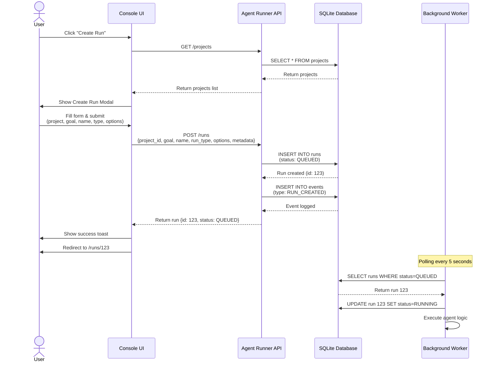
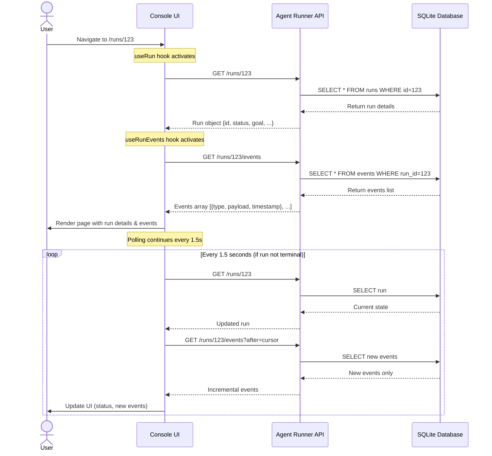
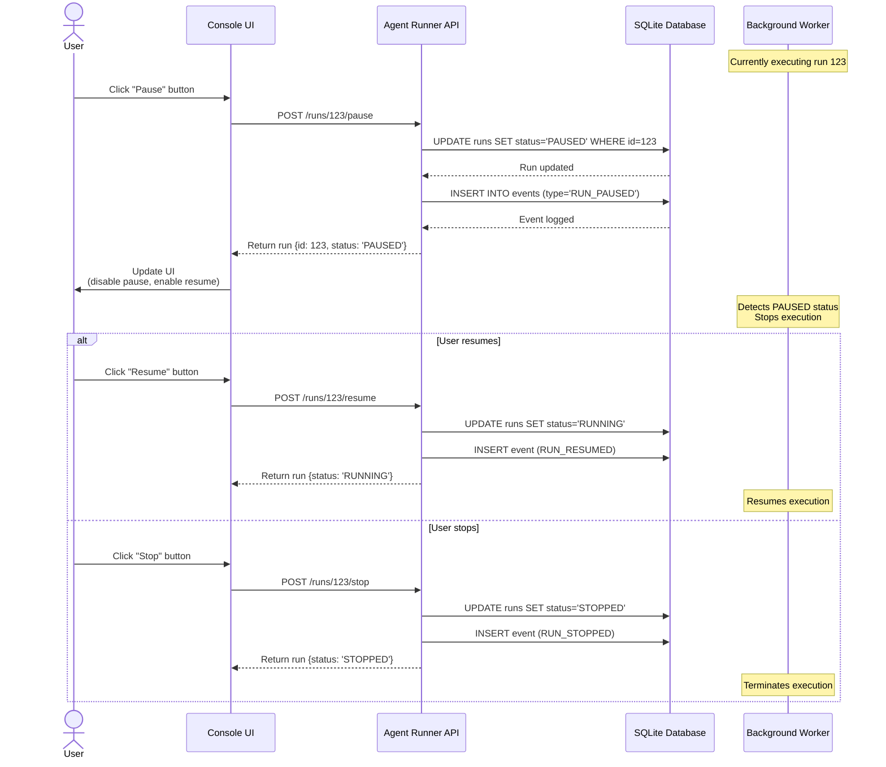
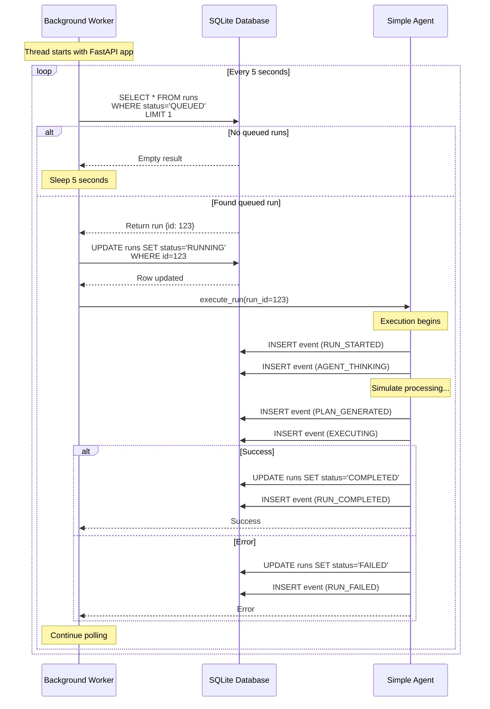
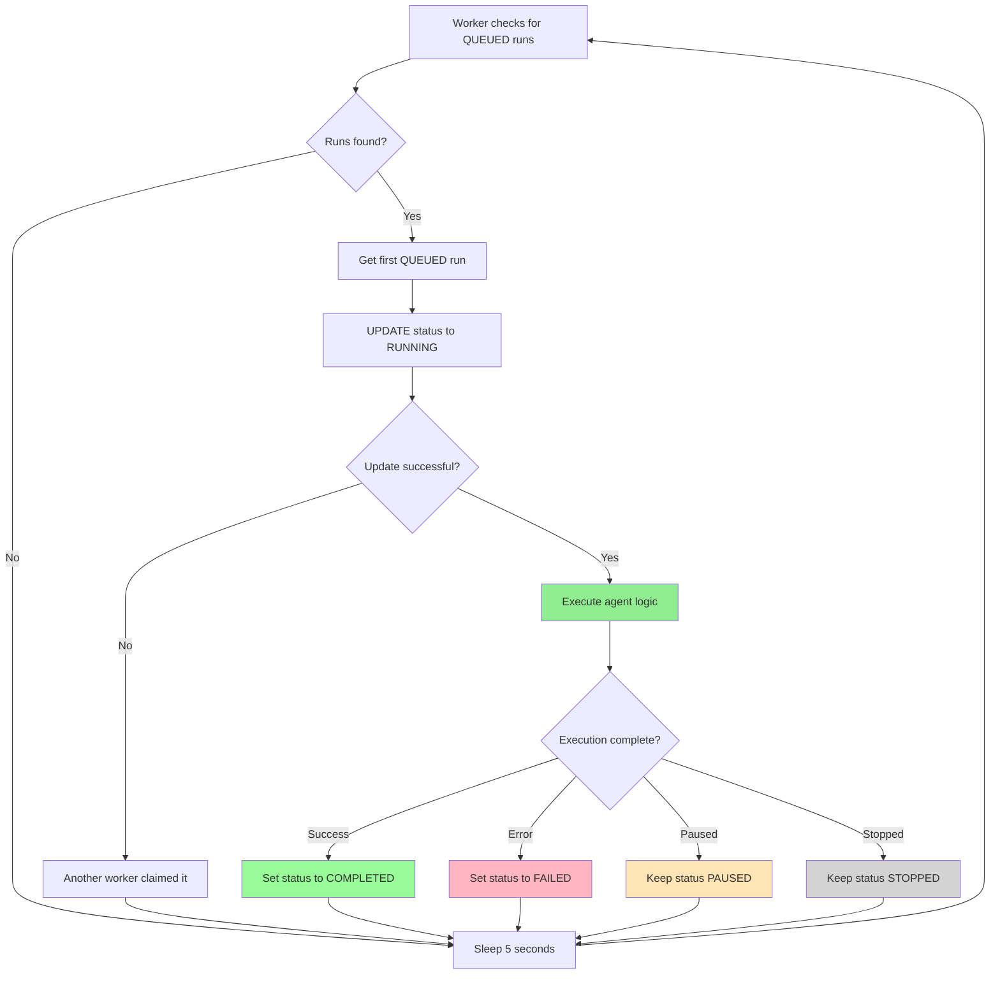
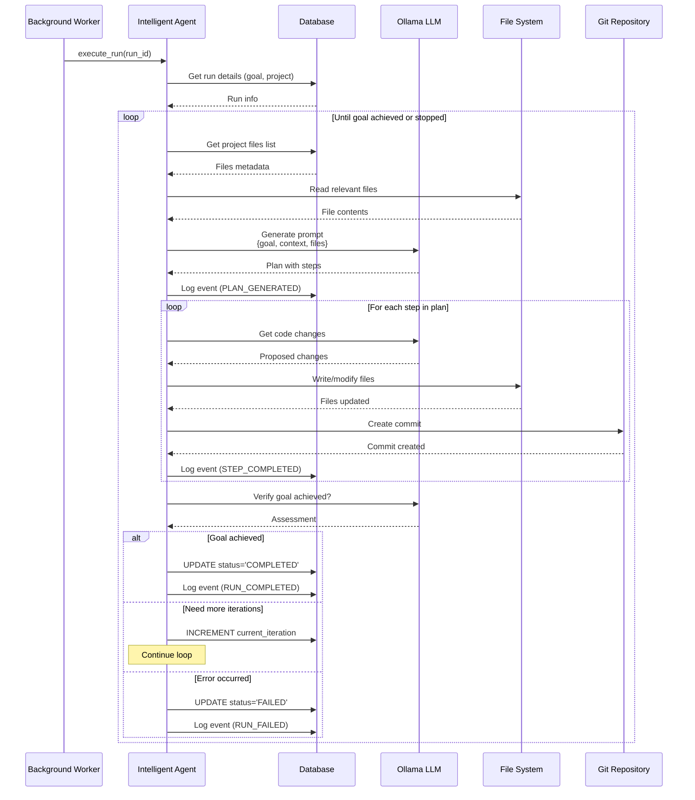
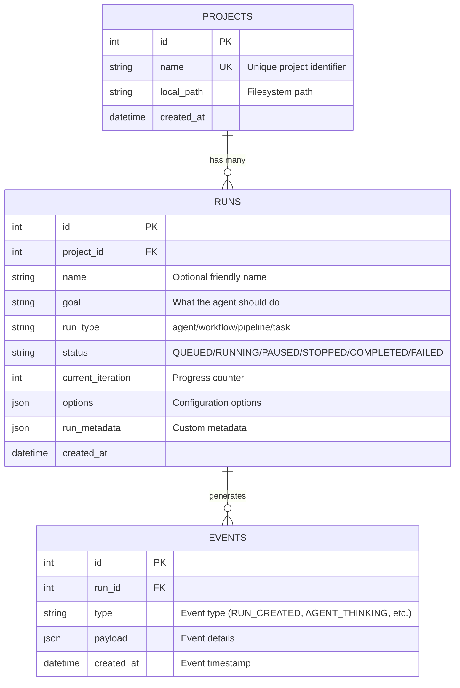

# Architecture Diagram - Agent Runner

## 📊 Services Overview

| Service | Port | Technology | Description |
|---------|------|------------|-------------|
| **Console** | 3001 | Next.js 16 + TypeScript | Web-based UI for managing projects and runs. Provides dashboard, run detail views, real-time status monitoring, and Create Run modal for configuring new agent executions. Includes status indicators for Worker, Forgejo, and Taiga. |
| **Agent Runner** | 8000 | FastAPI + Python 3.11 | REST API backend providing endpoints for CRUD operations on projects, runs, and events. Handles validation, database transactions, and serves OpenAPI docs at `/docs`. Supporting universal binding (0.0.0.0). |
| **Background Worker** | N/A (in-process) | Python Threading | Background thread within Agent Runner that polls for QUEUED runs, claims them atomically, executes agent logic, and logs events. Configurable via `WORKER_CHECK_INTERVAL`. |
| **SQLite DB** | N/A (embedded) | SQLite 3 | Embedded relational database storing projects, runs, and events. Located at `agent-runner/db/platform.db`. Simple, local-first, no separate server process. |
| **Forgejo** | 3000 | Docker (Gitea fork) | Self-hosted Git server for version control and code repository management. Available for use but not yet integrated with agent execution workflow. Status shown in Console UI. |
| **Taiga** | 9000 | Docker (Django/Angular) | Project management and agile collaboration tool. Provides issue tracking, kanban boards, and sprint planning. Available but not yet integrated. Status shown in Console UI. |
| **Ollama** | 11434 | Ollama | Local LLM inference server for running models like Llama, Mistral, etc. Planned for agent intelligence but not yet connected to agent execution logic. |

### Access URLs
- Console: `http://localhost:3001`
- Agent Runner API: `http://localhost:8000`
- Agent Runner Docs: `http://localhost:8000/docs` (Swagger UI)
- Forgejo: `http://localhost:3000` (if running)
- Taiga: `http://localhost:9000` (if running)

### Notes
- **Background Worker** and **SQLite DB** are embedded components that don't have separate ports
- **Forgejo** and **Taiga** runtime status is shown via indicators in the Console UI header
- **Ollama** is planned for future implementation to provide LLM capabilities to the agent
- **Port Conflict:** Console and Forgejo previously both defaulted to port 3000. Console has been moved to port 3001 to resolve this.
- **Environment Variables:** All service URLs, polling intervals, and timeouts are configurable via `.env` files.

---

## 🏗️ System Architecture

```
┌─────────────────────────────────────────────────────────────────┐
│                         HUMAN OPERATOR                           │
│                         (Web Browser)                            │
└───────────────────────────┬─────────────────────────────────────┘
                            │
                            │ HTTP (Port 3001)
                            │
┌───────────────────────────▼─────────────────────────────────────┐
│                      CONSOLE (Frontend)                          │
│                         ✅ ACTIVE                                │
│                                                                  │
│  Next.js 16 + TypeScript + App Router                          │
│  ┌────────────────┐  ┌──────────────────┐  ┌───────────────┐  │
│  │  Home Page     │  │  Run Detail Page │  │  Status Bar   │  │
│  │  /             │  │  /runs/[id]      │  │               │  │
│  │                │  │                  │  │  - Worker     │  │
│  │  - Projects    │  │  - Run info      │  │  - Forgejo 🟡│  │
│  │  - Runs list   │  │  - Events        │  │  - Taiga 🟡  │  │
│  │  - Stats       │  │  - Controls      │  │               │  │
│  │  - Create Run  │  │  - Directives    │  │               │  │
│  │    Modal       │  │                  │  │               │  │
│  └────────────────┘  └──────────────────┘  └───────────────┘  │
│                                                                  │
│  ┌──────────────────────────────────────────────────────────┐  │
│  │           Create Run Modal (Enhanced)                     │  │
│  │  - Run name (optional, auto-generated)                   │  │
│  │  - Run type (agent/workflow/pipeline/task)               │  │
│  │  - Goal (required)                                        │  │
│  │  - Options (dry_run, verbose, max_steps)                 │  │
│  │  - Custom metadata (JSON validated)                      │  │
│  │  - Success toast + auto-navigation                       │  │
│  └──────────────────────────────────────────────────────────┘  │
│                                                                  │
└───────────────────────────┬─────────────────────────────────────┘
                            │
                            │ REST API (Port 8000)
                            │ process.env.NEXT_PUBLIC_AGENT_RUNNER_URL
                            │
┌───────────────────────────▼─────────────────────────────────────┐
│                   AGENT RUNNER (Backend)                         │
│                         ✅ ACTIVE                                │
│                                                                  │
│  FastAPI + Python 3.11                                          │
│  ┌──────────────────────────────────────────────────────────┐  │
│  │                      API Routes                           │  │
│  │                                                           │  │
│  │  POST /projects              GET  /projects              │  │
│  │  POST /runs (JSON body)      GET  /runs                  │  │
│  │  GET  /runs/{id}             GET  /runs/{id}/events      │  │
│  │  POST /runs/{id}/{action}    (pause|resume|stop)         │  │
│  │  POST /runs/{id}/directive                               │  │
│  │  GET  /worker/status         POST /worker/process        │  │
│  │  GET  /health                GET  /docs (Swagger)        │  │
│  └──────────────────────────────────────────────────────────┘  │
│                            │                                     │
│  ┌──────────────────────────────────────────────────────────┐  │
│  │            Background Worker (Active)                     │  │
│  │                                                           │  │
│  │  - Polls for QUEUED runs every 5 seconds                 │  │
│  │  - Claims runs atomically (prevents double-processing)   │  │
│  │  - Executes SimpleAgent logic                            │  │
│  │  - Logs events (STARTED, THINKING, COMPLETED, etc.)      │  │
│  │  - Updates run status                                     │  │
│  │  - Handles errors gracefully                              │  │
│  └──────────────────────────────────────────────────────────┘  │
│                            │                                     │
│  ┌──────────────────────────────────────────────────────────┐  │
│  │               SQLAlchemy Models                           │  │
│  │                                                           │  │
│  │  Project(id, name, local_path, created_at)              │  │
│  │  Run(id, project_id, name, goal, run_type, status,      │  │
│  │      current_iteration, options, run_metadata, ...)      │  │
│  │  Event(id, run_id, type, payload, created_at)           │  │
│  └──────────────────────────────────────────────────────────┘  │
│                            │                                     │
└────────────────────────────┼─────────────────────────────────────┘
                             │
                             │ SQLite
                             │
                    ┌────────▼────────┐
                    │  platform.db    │
                    │    ✅ ACTIVE    │
                    │                 │
                    │  agent-runner/  │
                    │  db/            │
                    └─────────────────┘


┌─────────────────────────────────────────────────────────────────┐
│                  OPTIONAL SERVICES (Docker)                      │
│                    🟡 Available but not integrated               │
├─────────────────────────────────────────────────────────────────┤
│                                                                  │
│  ┌────────────────────────────────┐  ┌──────────────────────┐  │
│  │  Forgejo (Git Server)          │  │  Taiga (PM)          │  │
│  │  Port: 3000                    │  │  Port: 9000          │  │
│  │                                │  │                      │  │
│  │  - Self-hosted Git             │  │  - Project mgmt      │  │
│  │  - Repository management       │  │  - Issue tracking    │  │
│  │  - Not yet integrated          │  │  - Not yet integrated│  │
│  └────────────────────────────────┘  └──────────────────────┘  │
│                                                                  │
└─────────────────────────────────────────────────────────────────┘


┌─────────────────────────────────────────────────────────────────┐
│                    FUTURE COMPONENTS                             │
│                    🔴 Not Yet Implemented                        │
├─────────────────────────────────────────────────────────────────┤
│                                                                  │
│  ┌────────────────┐  ┌────────────────┐  ┌─────────────────┐  │
│  │  Real Agent    │  │  Ollama LLM    │  │  File System    │  │
│  │  Execution     │  │  Integration   │  │  Operations     │  │
│  │                │  │                │  │                 │  │
│  │  - LLM prompts │  │  - Prompt      │  │  - Read files   │  │
│  │  - Code gen    │  │    generation  │  │  - Write files  │  │
│  │  - Diff review │  │  - Response    │  │  - Safety       │  │
│  │  - Iterations  │  │    parsing     │  │    checks       │  │
│  └────────────────┘  └────────────────┘  └─────────────────┘  │
│                                                                  │
│  ┌────────────────┐  ┌────────────────┐  ┌─────────────────┐  │
│  │  Git           │  │  Multi-Agent   │  │  Approval       │  │
│  │  Integration   │  │  Coordination  │  │  Workflow       │  │
│  │                │  │                │  │                 │  │
│  │  - Branch mgmt │  │  - Agent types │  │  - Review UI    │  │
│  │  - Diff view   │  │  - Dependencies│  │  - Commit ctrl  │  │
│  │  - Commit ctrl │  │  - Scheduling  │  │  - Rollback     │  │
│  └────────────────┘  └────────────────┘  └─────────────────┘  │
│                                                                  │
└─────────────────────────────────────────────────────────────────┘
```

---

## 🔄 Data Flow

### 1. Create Run Flow (Enhanced Modal)

**Textual Representation:**
```
Browser                Console               Agent Runner         Database
   │                      │                        │                  │
   │─── Click "Create ───▶│                        │                  │
   │     Run" button      │                        │                  │
   │                      │                        │                  │
   │◀── Open Modal ───────│                        │                  │
   │    - Fetch projects  │                        │                  │
   │    - Show form       │                        │                  │
   │                      │                        │                  │
   │─── Fill Form: ──────▶│                        │                  │
   │    - Select project  │                        │                  │
   │    - Enter goal      │                        │                  │
   │    - (Optional) name │                        │                  │
   │    - (Optional) type │                        │                  │
   │    - (Optional)      │                        │                  │
   │      options/metadata│                        │                  │
   │                      │                        │                  │
   │─── Submit Form ─────▶│                        │                  │
   │                      │                        │                  │
   │                      │─── POST /runs ────────▶│                  │
   │                      │    Content-Type:       │                  │
   │                      │    application/json    │                  │
   │                      │    {                   │                  │
   │                      │      project_id: 1,    │                  │
   │                      │      goal: "...",      │                  │
   │                      │      name: "...",      │                  │
   │                      │      run_type: "...",  │                  │
   │                      │      options: {...},   │                  │
   │                      │      metadata: {...}   │                  │
   │                      │    }                   │                  │
   │                      │                        │                  │
   │                      │                        │─── INSERT run ──▶│
   │                      │                        │    (with all     │
   │                      │                        │     new fields)  │
   │                      │                        │                  │
   │                      │                        │─── INSERT event ▶│
   │                      │                        │    (RUN_CREATED) │
   │                      │                        │                  │
   │                      │◀── Return run ─────────│                  │
   │                      │    {                   │                  │
   │                      │      id: 123,          │                  │
   │                      │      name: "...",      │                  │
   │                      │      status: "QUEUED", │                  │
   │                      │      ...               │                  │
   │                      │    }                   │                  │
   │                      │                        │                  │
   │◀── Success Toast ────│                        │                  │
   │    "Run created!"    │                        │                  │
   │                      │                        │                  │
   │◀── Redirect ─────────│                        │                  │
   │    /runs/123         │                        │                  │
   │                      │                        │                  │
   │                      │    ┌──────────────────────────────────┐  │
   │                      │    │  Background Worker (5s loop)     │  │
   │                      │    │  - Detects QUEUED run            │  │
   │                      │    │  - Claims it atomically          │  │
   │                      │    │  - Starts execution              │  │
   │                      │    └──────────────────────────────────┘  │
   │                      │                        │                  │
```

**Mermaid Sequence Diagram:**


### 2. View Run Flow

**Textual Representation:**
```
Browser                Console               Agent Runner         Database
   │                      │                        │                  │
   │─── Visit /runs/123 ─▶│                        │                  │
   │                      │                        │                  │
   │                      │─── GET /runs/123 ─────▶│                  │
   │                      │                        │                  │
   │                      │                        │─── SELECT run ──▶│
   │                      │                        │                  │
   │                      │◀── Return run ─────────│                  │
   │                      │                        │                  │
   │                      │─── GET /runs/123/      │                  │
   │                      │         events ────────▶│                  │
   │                      │                        │                  │
   │                      │                        │─── SELECT events ▶│
   │                      │                        │                  │
   │                      │◀── Return events ──────│                  │
   │                      │                        │                  │
   │◀── Render page ──────│                        │                  │
   │    (run + events)    │                        │                  │
```

**Mermaid Sequence Diagram:**


### 3. Control Run Flow (Pause)

**Textual Representation:**
```
Browser                Console               Agent Runner         Database
   │                      │                        │                  │
   │─── Click "Pause" ───▶│                        │                  │
   │                      │                        │                  │
   │                      │─── POST /runs/123/     │                  │
   │                      │         pause ─────────▶│                  │
   │                      │                        │                  │
   │                      │                        │─── UPDATE run ──▶│
   │                      │                        │    status=PAUSED │
   │                      │                        │                  │
   │                      │                        │─── INSERT event ▶│
   │                      │                        │    (RUN_PAUSE)   │
   │                      │                        │                  │
   │                      │◀── Return run ─────────│                  │
   │                      │    {status: "PAUSED"}  │                  │
   │                      │                        │                  │
   │◀── Update UI ────────│                        │                  │
   │    (disable pause,   │                        │                  │
   │     enable resume)   │                        │                  │
```

**Mermaid Sequence Diagram:**


### 4. Background Worker Execution Flow

**Mermaid Sequence Diagram:**


**Atomic Claiming Mechanism:**

```
Browser                Console               Agent Runner         Database      Ollama    Git Repo
   │                      │                        │                  │            │           │
   │                      │                        │                  │            │           │
   │                      │      ┌─────────────────┤                  │            │           │
   │                      │      │ Background Task │                  │            │           │
   │                      │      │                 │                  │            │           │
   │                      │      │ While status    │                  │            │           │
   │                      │      │ == RUNNING:     │                  │            │           │
   │                      │      │                 │                  │            │           │
   │                      │      │  1. Get goal ───┼─── SELECT run ──▶│            │           │
   │                      │      │                 │                  │            │           │
   │                      │      │  2. Generate    │                  │            │           │
   │                      │      │     prompt ─────┼──────────────────┼─── POST ──▶│           │
   │                      │      │                 │                  │   /generate│           │
   │                      │      │                 │                  │            │           │
   │                      │      │  3. Get plan ◀──┼──────────────────┼─────────── │           │
   │                      │      │                 │                  │  {response}│           │
   │                      │      │                 │                  │            │           │
   │                      │      │  4. Log event ──┼─── INSERT event ▶│            │           │
   │                      │      │                 │   (PLAN_GENERATED)            │           │
   │                      │      │                 │                  │            │           │
   │                      │      │  5. Execute ────┼──────────────────┼────────────┼─ read ───▶│
   │                      │      │     steps       │                  │            │           │
   │                      │      │                 │                  │            │           │
   │                      │      │  6. Write ──────┼──────────────────┼────────────┼─ write ──▶│
   │                      │      │     files       │                  │            │           │
   │                      │      │                 │                  │            │           │
   │                      │      │  7. Log events ─┼─── INSERT events ▶            │           │
   │                      │      │                 │                  │            │           │
   │                      │      │  8. Complete ───┼─── UPDATE run ──▶│            │           │
   │                      │      │                 │   status=COMPLETE            │           │
   │                      │      └─────────────────┤                  │            │           │
   │                      │                        │                  │            │           │
   │─── Refresh page ────▶│─── GET /runs/123 ─────▶│─── SELECT ──────▶│            │           │
   │                      │                        │                  │            │           │
   │◀── See updated ──────│◀── Return run ─────────│                  │            │           │
   │    status            │    {status: "COMPLETE"}│                  │            │           │
```

### 5. Future: Full Agent Intelligence Flow (Not Yet Implemented)

**Planned Architecture:**


**Original Textual Representation:**
```
Browser                Console               Agent Runner         Database      Ollama    Git Repo
   │                      │                        │                  │            │           │
   │                      │                        │                  │            │           │
   │                      │      ┌─────────────────┤                  │            │           │
   │                      │      │ Background Task │                  │            │           │
   │                      │      │                 │                  │            │           │
   │                      │      │ While status    │                  │            │           │
   │                      │      │ == RUNNING:     │                  │            │           │
   │                      │      │                 │                  │            │           │
   │                      │      │  1. Get goal ───┼─── SELECT run ──▶│            │           │
   │                      │      │                 │                  │            │           │
   │                      │      │  2. Generate    │                  │            │           │
   │                      │      │     prompt ─────┼──────────────────┼─── POST ──▶│           │
   │                      │      │                 │                  │   /generate│           │
   │                      │      │                 │                  │            │           │
   │                      │      │  3. Get plan ◀──┼──────────────────┼─────────── │           │
   │                      │      │                 │                  │  {response}│           │
   │                      │      │                 │                  │            │           │
   │                      │      │  4. Log event ──┼─── INSERT event ▶│            │           │
   │                      │      │                 │   (PLAN_GENERATED)            │           │
   │                      │      │                 │                  │            │           │
   │                      │      │  5. Execute ────┼──────────────────┼────────────┼─ read ───▶│
   │                      │      │     steps       │                  │            │           │
   │                      │      │                 │                  │            │           │
   │                      │      │  6. Write ──────┼──────────────────┼────────────┼─ write ──▶│
   │                      │      │     files       │                  │            │           │
   │                      │      │                 │                  │            │           │
   │                      │      │  7. Log events ─┼─── INSERT events ▶            │           │
   │                      │      │                 │                  │            │           │
   │                      │      │  8. Complete ───┼─── UPDATE run ──▶│            │           │
   │                      │      │                 │   status=COMPLETE            │           │
   │                      │      └─────────────────┤                  │            │           │
   │                      │                        │                  │            │           │
   │─── Refresh page ────▶│─── GET /runs/123 ─────▶│─── SELECT ──────▶│            │           │
   │                      │                        │                  │            │           │
   │◀── See updated ──────│◀── Return run ─────────│                  │            │           │
   │    status            │    {status: "COMPLETE"}│                  │            │           │
```

---

## 📦 Component Details

### Console (Frontend)
- **Framework**: Next.js 16 with App Router
- **Language**: TypeScript
- **Styling**: Tailwind CSS 4
- **State**: React 18 hooks (useState, useEffect, useRef, useCallback)
- **Polling**: Hardened custom hooks (`useRun`, `useRunEvents`, `usePolling`)
- **API Client**: Native fetch API with timeout wrapper

### Agent Runner (Backend)
- **Framework**: FastAPI
- **Language**: Python 3.11
- **ORM**: SQLAlchemy
- **Database**: SQLite
- **API Style**: RESTful
- **Validation**: FastAPI built-in

### Database Schema

**SQL Schema:**
```sql
CREATE TABLE projects (
    id INTEGER PRIMARY KEY,
    name TEXT UNIQUE NOT NULL,
    local_path TEXT NOT NULL,
    created_at TIMESTAMP DEFAULT CURRENT_TIMESTAMP
);

CREATE TABLE runs (
    id INTEGER PRIMARY KEY,
    project_id INTEGER,
    name TEXT,                          -- NEW: Optional run name
    goal TEXT NOT NULL,
    run_type TEXT DEFAULT 'agent',      -- NEW: agent/workflow/pipeline/task
    status TEXT DEFAULT 'QUEUED',
    current_iteration INTEGER DEFAULT 0,
    options TEXT,                       -- NEW: JSON string for options
    run_metadata TEXT,                  -- NEW: JSON string for custom metadata
    created_at TIMESTAMP DEFAULT CURRENT_TIMESTAMP,
    FOREIGN KEY (project_id) REFERENCES projects(id)
);

CREATE TABLE events (
    id INTEGER PRIMARY KEY,
    run_id INTEGER NOT NULL,
    type TEXT NOT NULL,
    payload TEXT,
    created_at TIMESTAMP DEFAULT CURRENT_TIMESTAMP
);
```

**Entity Relationship Diagram:**


**Run Status Values:**
- `QUEUED` - Waiting to be picked up by worker
- `RUNNING` - Currently executing
- `PAUSED` - Temporarily suspended by user
- `STOPPED` - Terminated by user
- `COMPLETED` - Successfully finished
- `FAILED` - Error occurred

**Common Event Types:**
- `RUN_CREATED` - Run was created
- `RUN_STARTED` - Execution began
- `AGENT_THINKING` - Agent is analyzing
- `PLAN_GENERATED` - Plan created
- `EXECUTING` - Executing steps
- `RUN_PAUSED` - Execution paused
- `RUN_RESUMED` - Execution resumed
- `RUN_STOPPED` - Execution stopped
- `RUN_COMPLETED` - Successfully completed
- `RUN_FAILED` - Failed with error

---

## 🔌 Integration Points

### Currently Integrated
- ✅ Console ↔ Agent Runner (REST API)
- ✅ Agent Runner ↔ SQLite (Database)

### Not Yet Integrated
- ❌ Agent Runner ↔ Ollama (LLM)
- ❌ Agent Runner ↔ File System (Project repos)
- ❌ Agent Runner ↔ Git (Version control)
- ❌ Console ↔ WebSockets (Real-time updates)
- ❌ Agent Runner ↔ Forgejo (Git operations)
- ❌ Agent Runner ↔ Taiga (Project management)

---

*Last updated: February 1, 2026*
