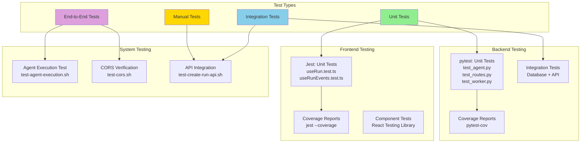

# Testing Guide

## Overview

The system includes comprehensive tests for both the Python backend (`pytest`) and the TypeScript frontend (`Jest`).



## Running Tests

### Makefile Targets (Unified)

```bash
# Run all tests (backend + frontend)
make test

# Backend only (verbose)
make test-verbose

# Backend with coverage
make test-coverage

# End-to-end agent execution test
make test-agent

# Verify CORS configuration
make test-cors
```

### Frontend (Jest)

Tests for React hooks (`useRun`, `useRunEvents`) are located in `console/src/hooks/__tests__/`.

```bash
cd console

# Run all tests
npm test

# Run with coverage
npm run test:coverage

# Watch mode for development
npm run test:watch
```

### Manual pytest Commands

```bash
cd agent-runner
source .venv/bin/activate

# Run all tests
pytest

# Run specific test file
pytest tests/test_agent.py

# Run specific test
pytest tests/test_agent.py::TestSimpleAgent::test_execute_run_claims_atomically

# Run with coverage
pytest --cov=app --cov-report=html
```

## Test Structure

```
agent-runner/tests/
├── __init__.py
├── test_agent.py      # Unit tests for SimpleAgent
├── test_worker.py     # Unit tests for BackgroundWorker
└── test_routes.py     # Integration tests for API routes
```

## Test Categories

### Unit Tests

**test_agent.py** - Tests for the agent execution logic:
- Atomic run claiming
- Successful execution flow
- Error handling
- Event logging behavior

**test_worker.py** - Tests for the background worker:
- Thread lifecycle (start/stop)
- Run processing loop
- Error recovery
- Configuration via environment variables

### Integration Tests

**test_routes.py** - Tests for FastAPI routes:
- Health check endpoint
- Project CRUD operations
- Run CRUD operations
- Run control (pause/resume/stop)
- Event retrieval
- Directive creation
- Worker management endpoints

## Key Test Features

### Atomic Claiming Tests

Verifies that the atomic claim mechanism prevents double execution:

```python
def test_execute_run_claims_atomically(self):
    # Simulates another worker already claimed the run
    # Verifies this worker returns False without executing
```

### Transaction Consistency Tests

Verifies that events don't commit independently:

```python
def test_log_event_does_not_commit(self):
    # Verifies _log_event flushes but doesn't commit
    # Ensures caller controls transaction boundaries
```

### Error Recovery Tests

Verifies worker continues after errors:

```python
def test_worker_loop_handles_errors(self):
    # Simulates error in process_queued_runs
    # Verifies worker continues to next iteration
```

## Test Fixtures

### test_db

Creates a fresh database for each integration test:

```python
@pytest.fixture(scope="function")
def test_db():
    Base.metadata.create_all(bind=engine)
    yield
    Base.metadata.drop_all(bind=engine)
```

## Mocking Strategy

Tests use `unittest.mock` to isolate units:

- **Mock database sessions** - Test logic without real DB
- **Mock time.sleep** - Skip actual waits in tests
- **Mock threads** - Test thread management without actual threads

## Coverage Goals

Current coverage targets:
- **Agent module**: >90% coverage
- **Worker module**: >90% coverage  
- **Routes module**: >80% coverage

View coverage report:

```bash
make test-coverage
```

HTML report (more detailed):

```bash
cd agent-runner
source .venv/bin/activate
pytest --cov=app --cov-report=html
open htmlcov/index.html
```

## Writing New Tests

### Test Naming Convention

- File: `test_<module>.py`
- Class: `Test<Feature>`
- Method: `test_<specific_behavior>`

### Example Test

```python
def test_execute_run_claims_atomically(self):
    """Test that execute_run uses atomic claim to prevent double execution."""
    agent = SimpleAgent()
    
    # Setup mocks
    mock_db = Mock()
    mock_query = Mock()
    mock_query.filter.return_value.update.return_value = 0
    mock_db.query.return_value = mock_query
    
    # Execute
    with patch('app.agent.SessionLocal', return_value=mock_db):
        result = agent.execute_run(1)
    
    # Assert
    assert result is False
    mock_query.filter.return_value.update.assert_called_once()
```

## Continuous Integration

### Pre-commit Checks

Before committing, run:

```bash
make test
```

### GitHub Actions (Future)

When CI is set up, tests will run on:
- Pull requests
- Pushes to main branch
- Scheduled daily runs

## Troubleshooting

### Import Errors

If you see import errors, ensure venv is activated:

```bash
cd agent-runner
source .venv/bin/activate
pip install -r requirements.txt
```

### Database Errors

Tests create temporary databases. If you see "database locked" errors:

```bash
# Stop the agent runner
pkill -f "uvicorn"

# Run tests again
make test
```

### Slow Tests

Some integration tests hit the database. To run only fast unit tests:

```bash
cd agent-runner
source .venv/bin/activate
pytest -m "not slow"
```

## Test Data

Tests use:
- **Mocked data** for unit tests (no real DB)
- **SQLite in-memory** for integration tests (isolated)
- **Test fixtures** for consistent setup

## Best Practices

1. **Isolate tests** - Each test should be independent
2. **Mock external dependencies** - Don't hit real LLMs, Git, etc.
3. **Test edge cases** - Especially error conditions
4. **Keep tests fast** - Use mocks to avoid I/O
5. **Descriptive names** - Test name should explain what it tests
6. **One assertion per test** - Makes failures clear

## Future Enhancements

- [ ] Add performance/load tests
- [ ] Add E2E tests with real database
- [ ] Add mutation testing
- [ ] Add contract tests for API
- [x] Add frontend tests (Jest/React Testing Library)
- [ ] Set up GitHub Actions CI

---

**Status:** Unit tests implemented ✅  
**Coverage:** Agent >90%, Worker >90%, Routes >80%  
**Command:** `make test`
